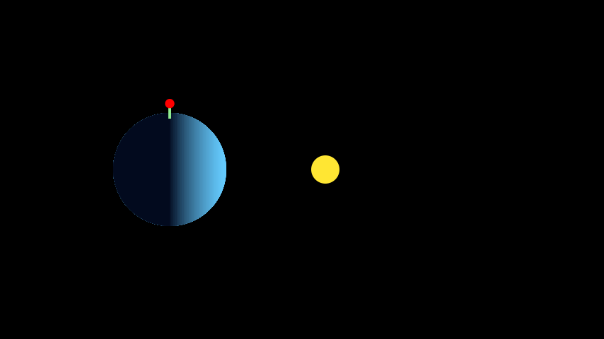

# 44 Sunsets

Animation of the 44 sunsets seen on a single day by the [The Little Prince](https://en.wikipedia.org/wiki/The_Little_Prince) (*"Le Petit Prince"*, by [Antoine de Saint-Exupéry](https://en.wikipedia.org/wiki/Antoine_de_Saint-Exupéry), in the original).

Made in [Julia](https://julialang.org), with [Wikunia/Javis.jl](https://github.com/Wikunia/Javis.jl), which is based on [JuliaGraphics/Luxor.jl](https://github.com/JuliaGraphics/Luxor.jl) and [JuliaGraphics/Cairo.jl](https://github.com/JuliaGraphics/Cairo.jl).

This is an ongoing project by [Caio César](https://github.com/usingcaio), Fred and [Ricardo Rosa](https://github.com/rmsrosa).

Here is the current, preliminary, version of the animation:

